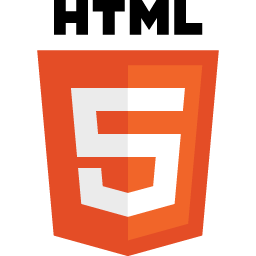
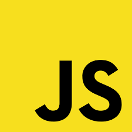
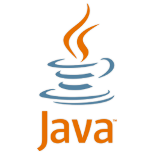
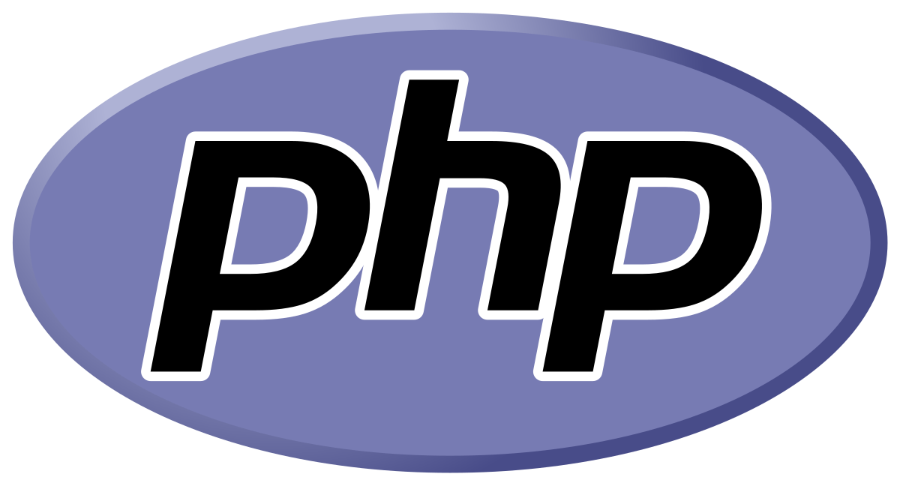
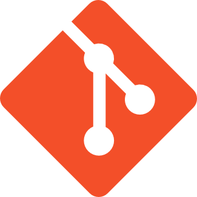
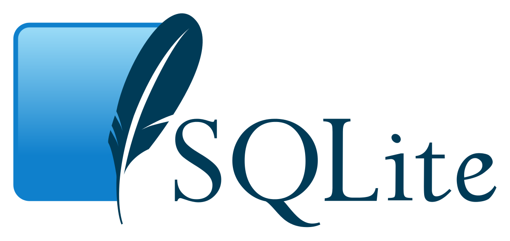

# Hi there! 👋 I'm Isabella :woman: :computer: 
## I'm a Systems engineer student, looking for new opportunities ✨

[]

## About
* Currently learning React and Nodejs making my path to become a Fullstack JavaScript developer.
* Looking to collaborate on **JavaScript based projects**

## 💻 Technologies I've worked with

<code></code>
<code></code>
<code></code>
<code></code>
<code></code>
<code></code>
<code></code>
<code></code>

#### Database
<code></code>
<code></code>

#### Mobile
<code></code>

## 📭 Get in touch
* [LinkedIn](https://www.linkedin.com/in/isabella-serna-48499015a/)
* [About](https://isabellaserna.co/)

<!--
**Isabella-417/Isabella-417** is a ✨ _special_ ✨ repository because its `README.md` (this file) appears on your GitHub profile.

Here are some ideas to get you started:

- 🔭 I’m currently working on ...
- 👯 I’m looking to collaborate on ...
- 🤔 I’m looking for help with ...
- 💬 Ask me about ...
- 📫 How to reach me: ...
- 😄 Pronouns: ...
- ⚡ Fun fact: ...
-->
